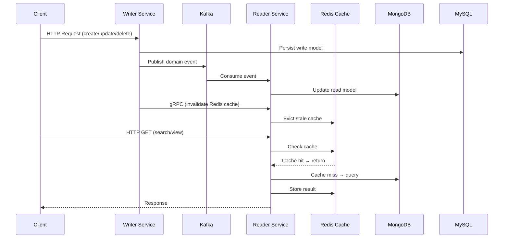

# 🎬 Video Management — CQRS Microservices

A production-style **video management backend** built with Golang, applying **CQRS** (Command Query Responsibility Segregation) pattern across microservices. Designed to handle video metadata, user interactions (comments, reactions, viewers), and real-time activity tracking at scale.

---

## ✨ Key Highlights

- **CQRS Pattern**: Writer service (MySQL) handles all write operations; Reader service (MongoDB + Redis) handles optimized read queries
- **Event-Driven**: Kafka message broker decouples services — writes publish events, readers consume and sync their own read models
- **Observability**: Full distributed tracing (Jaeger), metrics (Prometheus + Grafana), structured logging
- **Clean Architecture**: Strict separation of `domain → usecase → repository → delivery` layers
- **High-Performance HTTP**: [fasthttp](https://github.com/valyala/fasthttp) for the writer service HTTP layer
- **Type-safe ORM**: [ent](https://entgo.io/) for schema-first, code-generated database access

---

## 🛠 Tech Stack

| Layer | Technology |
|---|---|
| Language | [Go 1.21+](https://go.dev/) |
| HTTP Framework | [fasthttp](https://github.com/valyala/fasthttp) + [fasthttprouter](https://github.com/georgecookeIW/fasthttprouter) |
| Message Broker | [Kafka](https://github.com/segmentio/kafka-go) |
| Service Communication | [gRPC](https://github.com/grpc/grpc-go) |
| Write Database | MySQL (via [ent ORM](https://entgo.io/)) |
| Read Database | [MongoDB](https://github.com/mongodb/mongo-go-driver) |
| Cache | [Redis](https://github.com/go-redis/redis) |
| Distributed Tracing | [Jaeger](https://www.jaegertracing.io/) + [OpenTracing](https://opentracing.io/) |
| Metrics | [Prometheus](https://prometheus.io/) |
| Dashboards | [Grafana](https://grafana.com/) |
| API Docs | [Swagger](https://github.com/swaggo/swag) |
| Validation | [go-playground/validator](https://github.com/go-playground/validator) |

---

## 🏗 Architecture

### Why CQRS?

Video platforms have a **heavily asymmetric read/write ratio** — millions of reads (video feeds, search) vs. comparatively few writes (uploads, reactions). CQRS lets us:

- **Optimize each side independently**: the read model (MongoDB + Redis) is shaped for query performance, while the write model (MySQL) enforces data integrity
- **Scale independently**: the reader service can be scaled horizontally without affecting write throughput
- **Decouple via events**: Kafka acts as the source of truth for propagating state changes from writer → reader

### System Overview

```
Client
  │
  ├─► [Writer Service] ──► MySQL (ent ORM)
  │         │               └── activity history ──► MongoDB
  │         └──► Kafka (publish events)
  │                  │
  │                  └──► [Reader Service] ──► MongoDB (read model)
  │                               └──► Redis (cache layer)
  │
  └─► [Reader Service] via gRPC (cache invalidation from Writer)
```

### Message Flow (Consumer)



---

## 📁 Project Structure

```
.
├── MakeFile
├── README.md
├── go.mod / go.sum
├── main.go
├── cmd/                          # Root entry point
├── core/                         # Shared packages across services
│   ├── pkg/
│   │   ├── kafka/                # Kafka producer, consumer, reader, writer
│   │   ├── logger/               # Structured logger
│   │   ├── mysql/                # MySQL/ent connection setup
│   │   ├── mongodb/              # MongoDB connection
│   │   ├── redis/                # Redis connection
│   │   ├── tracing/              # Jaeger tracer init
│   │   ├── interceptors/         # gRPC interceptors
│   │   ├── grpc_client/          # gRPC client factory
│   │   ├── constants/            # Global constants
│   │   ├── http_errors/          # HTTP error types
│   │   └── http_utils/           # HTTP helpers
│   ├── proto/
│   │   ├── kafka/                # Kafka protobuf definitions
│   │   └── services/
│   │       ├── writer/           # Writer service gRPC proto
│   │       └── reader/           # Reader service gRPC proto
│   └── migrations/               # SQL migration files + MongoDB init scripts
├── ent/                          # Generated ent ORM code
│   ├── schema/                   # Entity schema definitions
│   ├── videos.*                  # Video entity CRUD
│   ├── comments.*                # Comment entity CRUD
│   ├── reactions.*               # Reaction entity CRUD
│   ├── objects.*                 # Object (thumbnail/file) entity CRUD
│   └── viewers.*                 # Viewer tracking entity CRUD
├── writer_service/               # Write-side microservice
│   ├── cmd/main.go
│   ├── config/
│   ├── server/                   # Server bootstrap + wiring
│   └── internal/
│       ├── delivery/
│       │   ├── http/v1/          # HTTP handlers (video, comment, reaction, object, viewer)
│       │   ├── grpc/             # gRPC service handlers
│       │   └── kafka/            # Kafka consumers (message processor)
│       ├── domain/
│       │   ├── models/           # Domain model definitions
│       │   ├── repositories/     # Repository interfaces
│       │   ├── usecase/          # Usecase interfaces
│       │   └── services/         # External service interfaces (upload)
│       ├── usecase/              # Usecase implementations
│       │   ├── video/
│       │   ├── comment/
│       │   ├── reaction/
│       │   ├── object/
│       │   ├── viewer/
│       │   └── activity_history/
│       ├── repositories/         # Repository implementations
│       │   ├── video/            # MySQL via ent
│       │   ├── comment/          # MySQL via ent
│       │   ├── reaction/         # MySQL via ent
│       │   ├── object/           # MySQL via ent
│       │   ├── viewer/           # MySQL via ent
│       │   └── activity_history/ # MongoDB
│       ├── services/
│       │   └── upload/           # File upload service (S3/local)
│       ├── metrics/              # Prometheus metrics definitions
│       ├── middlewares/          # CORS, recovery, auth middlewares
│       └── dto/                  # Request/response DTOs + proto mappings
└── reader_service/               # Read-side microservice
    ├── cmd/main.go
    ├── config/
    ├── server/
    └── internal/
        ├── delivery/
        │   ├── grpc/             # gRPC handlers (cache invalidation)
        │   └── kafka/            # Kafka consumers (sync read model)
        ├── domain/
        │   ├── models/
        │   ├── repositories/
        │   └── usecase/
        │       └── video.go      # IVideoUsecase: GetVideoById, SearchVideo, InvalidateCache
        ├── usecase/              # Read-optimized usecase implementations
        ├── repositories/         # MongoDB + Redis repository implementations
        ├── metrics/
        └── dto/
```

### Layer Responsibilities

| Layer | Responsibility |
|---|---|
| `delivery/` | Protocol-specific entry points (HTTP, gRPC, Kafka). Translates requests to usecase calls |
| `usecase/` | Business logic. Orchestrates domain operations |
| `repositories/` | Data access implementations. Abstracts DB/cache interactions |
| `domain/` | Interfaces and models. No infrastructure dependencies |
| `dto/` | Data transfer objects — shapes data for protocol boundaries |
| `metrics/` | Prometheus counter/histogram setup per service |

---

## 🗄 Domain Entities

| Entity | Description |
|---|---|
| **Video** | Core entity. Stores metadata, upload state, view count |
| **Comment** | User comments on videos. Nested replies supported |
| **Reaction** | Like/dislike reactions on videos or comments |
| **Object** | Binary objects (thumbnails, video files) associated with a video |
| **Viewer** | Tracks unique viewers per video (for real-time ranking) |
| **ActivityHistory** | Append-only activity log stored in MongoDB |

---

## 🚀 Local Development

### Prerequisites

Install the following tools before running:

- [Docker](https://docs.docker.com/get-docker/) + Docker Compose
- [mongosh](https://www.mongodb.com/docs/mongodb-shell/install/)
- [golang-migrate](https://github.com/golang-migrate/migrate)
- [swag](https://github.com/swaggo/swag) — `go install github.com/swaggo/swag/cmd/swag@latest`
- [protoc](https://grpc.io/docs/protoc-installation/) (only if modifying proto files)

### Setup Steps

```bash
# 1. Start all infrastructure (Kafka, MySQL, MongoDB, Redis, Jaeger, Prometheus, Grafana)
make docker_dev

# 2. Run SQL migrations
make migrate_up

# 3. Initialize MongoDB (indexes, collections)
make mongo

# 4. Generate Swagger docs
make swagger

# 5. Run services locally (separate terminals)
make run_writer_microservice
make run_reader_microservice
```

> **Note (Ubuntu):** If you encounter permission errors on data volumes, run:
> ```bash
> sudo chown -R $(whoami) $(pwd)/slave_data
> sudo chown -R $(whoami) $(pwd)/master_data
> ```

### Run with Kafka UI

```bash
curl -L https://releases.conduktor.io/quick-start -o docker-compose.yml \
  && docker compose up -d --wait \
  && echo "Conduktor started on http://localhost:8080"
```

Connect by adding the `KAFKA_ADVERTISED_LISTENERS` value from `docker-compose.yaml` as the cluster host.

---

## 🔍 Observability Endpoints

| Tool | URL | Purpose |
|---|---|---|
| Swagger | http://localhost:5001/swagger/index.html | API documentation |
| Jaeger | http://localhost:16686 | Distributed trace viewer |
| Prometheus | http://localhost:9090 | Metrics & alerting |
| Grafana | http://localhost:3000 | Dashboards |

---

## ⚙️ Makefile Commands

```bash
make docker_dev          # Start docker compose (full infra)
make local               # Start local-only docker compose
make run_writer_microservice  # Run writer service
make run_reader_microservice  # Run reader service
make migrate_up          # Apply SQL migrations
make migrate_down        # Rollback last migration
make mongo               # Init MongoDB collections/indexes
make swagger             # Regenerate Swagger docs
make proto_writer        # Regenerate writer gRPC proto
make proto_reader        # Regenerate reader gRPC proto
make run-linter          # Run golangci-lint
make pprof_heap          # Profile heap memory
make pprof_cpu           # Profile CPU
make tidy                # go mod tidy
```

---

## 🧰 Working with ent ORM

This project uses [ent](https://entgo.io/) — a schema-first, type-safe ORM for Go.

**Define a new entity:**
```bash
go run -mod=mod entgo.io/ent/cmd/ent new Videos
```

**Customize schema** in `ent/schema/videos.go`:
```go
func (Videos) Fields() []ent.Field {
    return []ent.Field{
        field.String("title").NotEmpty(),
        field.String("description").Optional(),
        field.Enum("status").Values("pending", "processing", "ready", "failed"),
        field.Time("created_at").Default(time.Now),
    }
}
```

**Regenerate code after schema changes:**
```bash
go generate ./ent
```

**Custom table name:**
```go
func (Videos) Annotations() []schema.Annotation {
    return []schema.Annotation{
        entsql.Annotation{Table: "videos"},
    }
}
```

---

## 🔑 Design Decisions

### MySQL (Write) + MongoDB (Read)
- **MySQL** guarantees ACID transactions for write operations (video create/update/delete)
- **MongoDB** stores pre-shaped read models optimized for query patterns (search, aggregation)
- This avoids N+1 queries and expensive joins on the read path

### Redis Cache Strategy
The reader service applies **cache-aside** pattern:
1. Check Redis first
2. On miss → query MongoDB, then populate cache
3. On write events → writer service calls reader via gRPC to `InvalidateCache`

### MongoDB for Activity History
Activity logs are append-only with high write frequency → MongoDB's document model and horizontal scalability fit better than relational tables.

### Kafka for Event Propagation
Writer service publishes domain events to Kafka topics. Reader service consumes them to update its read model asynchronously. This ensures the writer is never blocked by read model synchronization.

---

## 📌 Known Limitations / Possible Improvements

- [ ] API Gateway service (scaffolded but not fully implemented)
- [ ] Unit and integration tests
- [ ] Authentication / JWT middleware
- [ ] Rate limiting
- [ ] Video file storage abstraction (currently mocked via upload service)
- [ ] Outbox pattern to guarantee exactly-once event delivery
